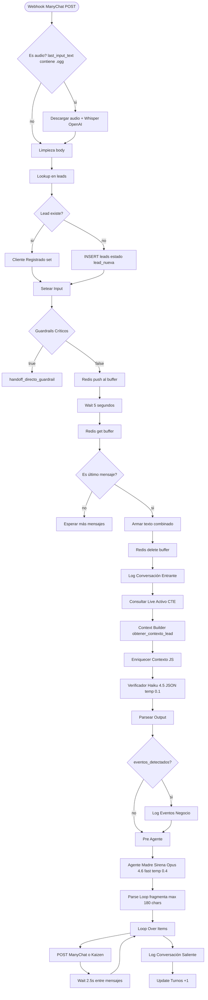

# Mar de Plata Taxco · Base de conocimiento

> Este archivo es leído automáticamente por Claude Code al iniciar cualquier sesión sobre este repo. Es la fuente de verdad técnica del proyecto. Si algo aquí contradice un mensaje suelto en chat, **gana este documento**.

**Versión:** documento técnico autocontenido v.2026.05.27 FINAL · azxion / mar_de_plata_taxco

---

## 1. Propósito y contexto del negocio

**Mar de Plata Taxco** vende joyería de plata 925 en Taxco, Guerrero. Catálogo: réplicas Pandora, Taxco artesanal, TOWS.

**El problema que la app resuelve:** volumen de 600–800 mensajes/día en campañas Meta. El sistema manual no aguanta y a Mar le bloquearon WhatsApp 3 veces. Las 4 promesas del proyecto:

1. Reactivar Meta sin bloqueo
2. Escalar mayoreo sin saturar al equipo
3. Que el grupo abierto siga siendo motor de conversión
4. Que Mar lidere desde lejos

**Actores:**
- **Mar** — dueña, admin del dashboard
- **Eli** y **Nat** — asesoras senior
- **Persona nueva** — en onboarding
- **Sirena** — el bot (vive en el número WhatsApp del negocio, no en grupo ni Facebook)
- La hermana de Mar (Caprichos de Plata) está **fuera** del sistema aunque comparten local

**Frase que define a Mar:** *"mi objetivo es no necesitar vacaciones"*. Quiere abrir sucursal en CDMX, Puebla o Querétaro.

---

## 2. Montos sagrados (nunca inventar otros)

- **Mínimo mayoreo por catálogo:** $1,500 MXN (mercancía sola, envío aparte)
- **Depósito primera vez** para apartar en live/grupo: $300 MXN (descontable del total, **solo primera vez**)
- Si ya pagó depósito antes (revisar `depositos_primera_vez`), **NO volver a pedirlo**

---

## 3. Las 5 ramas

| Rama | Nombre | Qué hace Sirena |
|---|---|---|
| **R1** | Mayoreo catálogo | Envía catálogo Canva, responde FAQs con imágenes, manda políticas una sola vez, deriva |
| **R2** | Mayoreo grupo | Link del grupo, manda solicitud, Mar la acepta manual |
| **R3** | Menudeo | Link a página web, cierre autónomo sin asesora |
| **R4** | Compras en vivo | Dinámica, horario, pide $300 si primera vez, detecta comprobante, bienvenida, handoff |
| **R5** | Visita presencial | Pregunta cuándo, imagen #23 entre semana o #24 sábado, ubicación, deriva |

---

## 4. Stack técnico

```
Next.js 14 (App Router) + TypeScript estricto
Tailwind CSS + shadcn/ui
Supabase JS SDK (@supabase/supabase-js, @supabase/ssr)
SWR (refresh 30s)
Recharts (gráficas)
OpenRouter (LLM gateway)
ManyChat (WhatsApp delivery)
Redis (buffer de 5s de mensajes) — o Vercel KV
OpenAI Whisper (transcripción de audio)
```

**Principios:**
- Server Components por default, Client Components solo donde hay interactividad
- Suspense + skeletons en cada bloque
- Desktop 1440x900+ primario, responsive móvil
- Minimalista flat, `stone-50` background, white cards
- Validación obligatoria por fase con Libi antes de avanzar

**Lo que NO se hace:**
- No OAuth ni magic links (auth básica email/password)
- No WebSockets ni real-time
- No Storybook ni Jest
- No inventar columnas
- No simplificar prompts
- No saltar guardrails
- No reemplazar n8n hasta validar todo en local

---

## 5. Variables de entorno

```
NEXT_PUBLIC_SUPABASE_URL=https://nbciljmueoihtzznmvdg.supabase.co
NEXT_PUBLIC_SUPABASE_ANON_KEY=[anon key pública]
SUPABASE_SERVICE_ROLE_KEY=[service role, solo server-side]
OPENROUTER_API_KEY=[server-side]
MANYCHAT_API_KEY=[de la credencial httpHeaderAuth "Salvador Manychat"]
OPENAI_API_KEY=[Whisper transcripción audio]
REDIS_URL=[opcional, o usar Vercel KV]
```

---

## 6. Schema real de Supabase

### leads
- `numero_whatsapp TEXT PK`
- `nombre`, `ciudad`, `estado_geografico`, `pais TEXT default 'MX'`
- `tipo TEXT (mayoreo, menudeo)`
- `estado TEXT default 'lead_nueva'` (`lead_nueva`, `calificada`, `esperando_pago`, `pagada`, `perdida`)
- `canal_origen`, `anuncio_id`
- `asesora_asignada TEXT FK→asesoras.id`
- `grupo_asignado TEXT default 'ninguno'`
- `fecha_asignacion TIMESTAMPTZ`
- `ticket_promedio NUMERIC default 0`
- `compras_totales INTEGER default 0`
- `monto_acumulado NUMERIC default 0`
- `fecha_primera_compra`, `fecha_ultima_compra TIMESTAMPTZ`
- `colecciones_favoritas TEXT[] default '{}'`
- `primer_contacto`, `ultima_interaccion TIMESTAMPTZ default now()`
- `etiquetas TEXT[] default '{}'`
- `reclamos_historicos INTEGER default 0`
- `created_at`, `updated_at`

### conversaciones
- `id BIGSERIAL PK`
- `numero_whatsapp TEXT NOT NULL FK`
- `timestamp TIMESTAMPTZ default now()`
- `direccion TEXT NOT NULL` (`entrante`, `saliente`)
- `texto TEXT`
- `tipo_mensaje TEXT default 'texto'`
- `media_url`
- `intencion_detectada`, `confianza NUMERIC`
- `rama_activada`, `tool_ejecutada`
- `parametros_tool JSONB`
- `status TEXT default 'completado'`
- `duracion_ms INTEGER`

### estado_conversacion_actual
- `numero_whatsapp TEXT PK FK`
- `rama_activa`, `paso_actual`
- `ultimo_tool_ejecutado`, `ultimo_timestamp TIMESTAMPTZ default now()`
- `catalogo_enviado BOOLEAN default false`
- `catalogo_tipo TEXT`
- `politicas_enviadas BOOLEAN default false`
- `grupo_invitado BOOLEAN default false`
- `faqs_respondidas INTEGER[] default '{}'`
- `turnos_acumulados INTEGER default 0`
- `inicio_conversacion TIMESTAMPTZ default now()`
- `intencion_compra_detectada BOOLEAN default false`
- `objecion_detectada TEXT`
- `requiere_handoff BOOLEAN default false`
- `prioridad_handoff TEXT default 'normal'`
- `conversacion_cerrada BOOLEAN default false`
- `motivo_cierre TEXT`

### asesoras
- `id TEXT PK`
- `nombre_completo TEXT NOT NULL`
- `whatsapp_personal`
- `activa BOOLEAN default true`
- `en_onboarding BOOLEAN default false`
- `horario_inicio TIME default '10:00'`
- `horario_fin TIME default '18:00'`
- `dias_laborales INTEGER[] default '{1,2,3,4,5}'`
- `conversaciones_abiertas INTEGER default 0`
- `conversaciones_dia INTEGER default 0`
- `ultima_asignacion TIMESTAMPTZ`

### alertas
- `id BIGSERIAL PK`
- `tipo TEXT NOT NULL` (`handoff_normal`, `handoff_urgente`, `guardrail_critico`, `reclamo`, `sin_respuesta_15min`, `sin_respuesta_2h`)
- `prioridad TEXT NOT NULL` (`baja`, `normal`, `alta`, `urgente`)
- `titulo TEXT NOT NULL`
- `descripcion`, `numero_whatsapp FK`, `asesora_asignada_id FK`
- `para_mar BOOLEAN default false`
- `estado TEXT default 'activa'` (`activa`, `vista`, `resuelta`, `archivada`)
- `resuelta_en`, `resuelta_por_id`, `notas_resolucion`
- `contexto_json JSONB default '{}'`
- `created_at`, `updated_at`

### eventos_negocio
- `id BIGSERIAL PK`
- `numero_whatsapp TEXT NOT NULL FK`
- `timestamp TIMESTAMPTZ default now()`
- `tipo_evento TEXT NOT NULL`
- `detalle TEXT`
- `contexto_turno_id BIGINT FK→conversaciones.id` — **dejar NULL si no hay turno asociado**
- `revisado BOOLEAN default false`
- `accion_tomada TEXT`

### eventos_live
- `id BIGSERIAL PK`
- `fecha_inicio`, `fecha_fin TIMESTAMPTZ NOT NULL`
- `red_social TEXT NOT NULL` (`facebook`, `instagram`, `tiktok`)
- `link_evento`, `codigo_descuento`, `descripcion_promo`
- `activo BOOLEAN default true`
- `creado_por_id FK`

### imagenes_faq
- `id INTEGER PK` — IDs fijos del 1 al 26, **no BIGSERIAL**
- `tag TEXT NOT NULL`
- `descripcion TEXT NOT NULL`
- `url_publica`, `categoria`
- `activa BOOLEAN default true`
- `ultima_actualizacion`, `notas`

### cierres_diarios
- `id BIGSERIAL PK`
- `numero_whatsapp FK`, `asesora_id FK`
- `monto NUMERIC NOT NULL`
- `canal TEXT NOT NULL` (`mayoreo_catalogo`, `mayoreo_grupo`, `menudeo`, `live`, `presencial`)
- `notas`, `comprobante_url`
- `fecha_cierre TIMESTAMPTZ default now()`

### depositos_primera_vez
- `id BIGSERIAL PK`
- `numero_whatsapp FK`
- `contexto TEXT NOT NULL` (`live`, `grupo`)
- `monto NUMERIC default 300`
- `comprobante_recibido_en TIMESTAMPTZ default now()`
- `asesora_validadora_id FK`
- `validado BOOLEAN default false`
- `notas`

### config_sistema
- `clave TEXT PK`
- `valor TEXT NOT NULL`
- `descripcion`, `actualizado_en`

Claves vivas: `link_grupo_abierto`, `catalogo_pandora_url`, `catalogo_taxco_url`, `catalogo_tows_url`, `whatsapp_mar_personal`, `subscriber_id_mar`, `monto_deposito_primera_vez` (300), `monto_minimo_mayoreo` (1500).

### Auxiliares
- `faqs_candidatas` — Kaizen, pausado
- `seguimientos_programados` — cron pendiente
- `chat_memory` — memoria conversacional LangChain

---

## 7. Funciones SQL custom (ya existen)

### `obtener_contexto_lead(p_numero TEXT) → JSONB`
**USAR ESTA** en lugar de hacer 4 queries separadas. Devuelve:
```json
{
  "lead": {...},
  "estado_actual": {...},
  "ultimos_mensajes": [...últimos 5],
  "eventos_recientes": [...últimos 10],
  "seguimientos_pendientes": [...],
  "metadata": {
    "hora_actual": "...",
    "es_horario_habil": true|false,
    "dias_desde_ultima_interaccion": number
  }
}
```

Llamada: `SELECT obtener_contexto_lead($1::text) AS contexto;`

### `consultar_live_activo() → record`
**NOTA:** problemas de permisos en pooler. **NO usar esta función**. Ejecutar query directa con CTE (ver paso 9 del flujo madre).

### `resetear_conversaciones_inactivas() → integer`
Limpia conversaciones >48h. Cron semanal: `SELECT resetear_conversaciones_inactivas();`

### Triggers que ya existen (no duplicar)
- `crear_estado_conversacion` — al INSERT en `leads` crea fila en `estado_conversacion_actual` con ON CONFLICT DO NOTHING. **No hacer INSERT manual.**
- `actualizar_ultima_interaccion` — al INSERT en `conversaciones` actualiza `leads.ultima_interaccion`. **No hacer UPDATE manual.**
- `update_updated_at_column` y `update_alertas_timestamp` — genéricos.

---

## 8. Mapeo FAQ → id_imagen [OFICIAL]

| FAQ | id_imagen |
|---|---|
| Material/composición | 1 |
| Mínimo de compra | 2 |
| Originalidad/autenticidad | 3 |
| Dinámica de compra | 4 |
| Tiempo de fabricación | 5 |
| Formas de pago | 15 |
| Pagos con tarjeta | 16 |
| Envíos (parte 1) | 17 |
| Envíos (parte 2) | 18 |
| Ubicación entre semana | 23 |
| Ubicación sábado | 24 |
| Horario de live | 26 |

---

## 9. Diagrama maestro del flujo



---

## 10. El flujo madre paso a paso

### Paso 1 · Webhook recibe
Endpoint POST `/api/webhook/manychat`. Headers capturados: `x-kaizen-session-id`, `x-kaizen-callback` (modo testing). Body de ManyChat: `last_input_text`, `phone`, `whatsapp_phone`, `id` (subscriber_id), `email`, `timezone`, `canal_origen`, `anuncio_id`.

### Paso 2 · Detectar audio
```ts
if (body.last_input_text.includes('.ogg')) {
  // descargar URL audio + Whisper + reemplazar last_input_text + marcar tipo_mensaje_original='audio'
}
```

### Paso 3 · Limpieza (código real)
```ts
function clean(v) { if (Array.isArray(v)) return v[0] ?? null; return v ?? null; }
const whatsappPhone = clean(p.whatsapp_phone);
const phone = clean(p.phone);
const igId = clean(p.ig_id);
const sessionId = 'mc_' + (whatsappPhone || phone || igId || 'unknown');
return {
  channel: 'manychat', sessionId,
  userText: clean(p.last_input_text) || '',
  whatsappPhone, email: clean(p.email),
  timezone: clean(p.timezone) || 'America/Mexico_City',
  tipoMensajeOriginal: clean(p.tipo_mensaje_original) || 'texto',
  canalOrigen: clean(p.canal_origen) || 'meta_ctwa',
  anuncioId: clean(p.anuncio_id)
};
```

### Paso 4 · Lookup lead
`SELECT * FROM leads WHERE numero_whatsapp = $1`. Si no existe, INSERT (el trigger crea `estado_conversacion_actual`).

### Paso 5 · Setear input
`{ text, session_id, bufferKey: 'mc:inbox:' + sessionId, whatsappPhone, tipoMensaje }`

### Paso 6 · Guardrails críticos [OFICIAL]
Keywords case-insensitive con OR: `asesora`, `humano`, `persona real`, `profeco`, `fraude`, `denunciar`.
Si HAY match → llamar `handoff_directo_guardrail` y RETURN early.

### Paso 7 · Buffer Redis (5 segundos)
- PUSH a lista `mc:inbox:{sessionId}` con el texto
- WAIT 5s
- GET lista, si último mensaje == actual → procesar; si no → esperar
- Concatenar con `\n`, DELETE lista

### Paso 8 · Log conversación entrante
INSERT en `conversaciones` con `direccion='entrante'`. NO incluir id, confianza, duracion_ms.

### Paso 9 · Consultar live activo (CTE directo, NO la función)
```sql
WITH live_activo AS (SELECT * FROM eventos_live WHERE activo=TRUE AND NOW() BETWEEN fecha_inicio AND fecha_fin ORDER BY fecha_inicio ASC LIMIT 1),
live_hoy AS (SELECT * FROM eventos_live WHERE activo=TRUE AND DATE(fecha_inicio AT TIME ZONE 'America/Mexico_City') = DATE(NOW() AT TIME ZONE 'America/Mexico_City') AND fecha_inicio > NOW() ORDER BY fecha_inicio ASC LIMIT 1),
live_futuro AS (SELECT * FROM eventos_live WHERE activo=TRUE AND fecha_inicio > NOW() ORDER BY fecha_inicio ASC LIMIT 1)
SELECT
  EXISTS(SELECT 1 FROM live_activo) AS hay_live_ahora,
  EXISTS(SELECT 1 FROM live_hoy) AS hay_live_hoy,
  COALESCE((SELECT id FROM live_activo),(SELECT id FROM live_hoy),(SELECT id FROM live_futuro)) AS proximo_live_id,
  COALESCE((SELECT fecha_inicio FROM live_activo),(SELECT fecha_inicio FROM live_hoy),(SELECT fecha_inicio FROM live_futuro)) AS proximo_live_fecha,
  COALESCE((SELECT red_social FROM live_activo),(SELECT red_social FROM live_hoy),(SELECT red_social FROM live_futuro)) AS proximo_live_red,
  COALESCE((SELECT codigo_descuento FROM live_activo),(SELECT codigo_descuento FROM live_hoy),(SELECT codigo_descuento FROM live_futuro)) AS proximo_live_codigo,
  COALESCE((SELECT descripcion_promo FROM live_activo),(SELECT descripcion_promo FROM live_hoy),(SELECT descripcion_promo FROM live_futuro)) AS proximo_live_descripcion,
  COALESCE((SELECT link_evento FROM live_activo),(SELECT link_evento FROM live_hoy),(SELECT link_evento FROM live_futuro)) AS proximo_live_link;
```

### Paso 10 · Context builder
`SELECT obtener_contexto_lead($1::text) AS contexto;` — una sola query reemplaza 4.

### Paso 11 · Enriquecer contexto (JS)
```ts
const formatter = new Intl.DateTimeFormat('es-MX', { timeZone: 'America/Mexico_City', weekday:'long', day:'numeric', month:'long', year:'numeric', hour:'2-digit', minute:'2-digit', hour12: false });
const dow = now.toLocaleString('en-US', { timeZone: 'America/Mexico_City', weekday: 'short' });
const hour = parseInt(now.toLocaleString('en-US', { timeZone: 'America/Mexico_City', hour: '2-digit', hour12: false }));
const esDiaHabil = !['Sat','Sun'].includes(dow);
const esHoraHabil = hour >= 10 && hour < 18;
return { contexto_lead, mensaje_actual, metadata: { hora_formateada, es_horario_habil: esDiaHabil && esHoraHabil, timestamp, live: {...} } };
```

### Paso 12 · Verificador
- Modelo: `anthropic/claude-haiku-4.5` vía OpenRouter
- `temperature: 0.1`, `max_tokens: 800`, `response_format: json_object`
- Prompt: ver sección 11

### Paso 13 · Parsear output del Verificador
Try/catch con fallback a JSON default (ambiguo + responder_texto_simple).

### Paso 14 · Log eventos de negocio (si hay)
```sql
INSERT INTO eventos_negocio (numero_whatsapp, tipo_evento, detalle)
SELECT $1::text, evento->>'tipo', evento->>'detalle'
FROM jsonb_array_elements($2::jsonb) AS evento;
```

### Paso 15 · Agente Madre
- Modelo: `anthropic/claude-opus-4.6-fast` vía OpenRouter
- `temperature: 0.4`, `max_tokens: 1024`
- system, user message y 5 tools como tool_use
- memory: `session_id`, persiste en `chat_memory`

### Paso 16 · Parse loop (fragmentar respuesta)
Código JS que divide en chunks ≤180 chars respetando saltos de párrafo, listas con guiones y URLs intactas. Ver sección 14.

### Paso 17 · Enviar a WhatsApp / Kaizen
Si vino `X-Kaizen-Session` header → POST a `https://kaizen.azxion.com/api/simulator/inbound`.
Si no → POST a `https://api.manychat.com/fb/sending/sendContent`.

Body:
```json
{
  "subscriber_id": "{subscriber_id}",
  "data": { "version": "v2", "content": { "type": "whatsapp", "messages": [{"type":"text","text":"..."}] } }
}
```
**Wait 2.5s entre mensajes consecutivos** del Parse Loop.

### Paso 18 · Log conversación saliente
INSERT con `direccion='saliente'`, NO incluir id, confianza, duracion_ms.

### Paso 19 · Update turnos
```sql
UPDATE estado_conversacion_actual SET turnos_acumulados = turnos_acumulados + 1, ultimo_timestamp = NOW() WHERE numero_whatsapp = $1;
```

---

## 11. Las 5 tools del Agente

### Tool 1 · enviar_imagen_faq
Params: `numero_whatsapp, id_imagen, texto_acompanante, subscriber_id`
1. `SELECT * FROM imagenes_faq WHERE id = $1 AND activa = true`
2. POST a ManyChat con texto + imagen `url_publica`
3. UPDATE `estado_conversacion_actual`:
```sql
UPDATE estado_conversacion_actual
SET faqs_respondidas = CASE
  WHEN $2::integer = ANY(faqs_respondidas) THEN faqs_respondidas
  ELSE array_append(faqs_respondidas, $2::integer)
END,
paso_actual = 'faq_respondida_esperando',
ultimo_tool_ejecutado = 'enviar_imagen_faq',
ultimo_timestamp = NOW()
WHERE numero_whatsapp = $1;
```
4. INSERT en `conversaciones` con `tool_ejecutada='enviar_imagen_faq'`, `parametros_tool={id_imagen}`, `media_url`, `tipo_mensaje='imagen'`

### Tool 2 · enviar_catalogo
Params: `numero_whatsapp, coleccion (pandora|taxco|tows), texto_acompanante, subscriber_id`
URLs en `config_sistema`:
- pandora → `https://www.canva.com/design/DAGgun-_kzE/isvBbeVkT0S448hgiqV3YA/view`
- taxco → `https://mardeplatataxco.my.canva.site/`
- tows → `https://mardeplatataxco.my.canva.site/tows`

UPDATE:
```sql
UPDATE estado_conversacion_actual SET catalogo_enviado=true, catalogo_tipo=$2, rama_activa='R1', paso_actual='catalogo_enviado', ultimo_tool_ejecutado='enviar_catalogo', ultimo_timestamp=NOW() WHERE numero_whatsapp=$1;
UPDATE leads SET tipo = COALESCE(tipo,'mayoreo'), estado = CASE WHEN estado='lead_nueva' THEN 'calificada' ELSE estado END WHERE numero_whatsapp = $1;
```

### Tool 3 · invitar_grupo
Params: `numero_whatsapp, texto_acompanante, subscriber_id`
Link en `config_sistema.link_grupo_abierto`: `https://chat.whatsapp.com/DtpuIyQljqhLu0B7pwnZkB?mode=ac_t`

```sql
UPDATE estado_conversacion_actual SET grupo_invitado=true, paso_actual='grupo_invitado', ultimo_tool_ejecutado='invitar_grupo', ultimo_timestamp=NOW(), rama_activa=COALESCE(rama_activa,'R2') WHERE numero_whatsapp=$1;
UPDATE leads SET grupo_asignado='abierto', tipo = COALESCE(tipo,'mayoreo') WHERE numero_whatsapp=$1;
```

### Tool 4 · handoff_asesora
Params: `numero_whatsapp, motivo, prioridad, contexto_breve, subscriber_id`

Round-robin si no hay asesora habitual:
```sql
SELECT id, nombre_completo, whatsapp_personal FROM asesoras
WHERE activa = true
ORDER BY CASE WHEN en_onboarding = true THEN 0 ELSE 1 END, conversaciones_abiertas ASC, ultima_asignacion ASC NULLS FIRST
LIMIT 1;
```

INSERT alerta:
```sql
INSERT INTO alertas (tipo, prioridad, titulo, descripcion, numero_whatsapp, asesora_asignada_id, para_mar, contexto_json)
VALUES (
  CASE WHEN $1='urgente' THEN 'handoff_urgente' WHEN $2 ILIKE '%reclamo%' THEN 'reclamo' ELSE 'handoff_normal' END,
  $1, 'Handoff · ' || $2, COALESCE($3,'Sin contexto adicional'), $4, $5,
  CASE WHEN $1='urgente' OR $2 ILIKE '%reclamo%' THEN TRUE ELSE FALSE END,
  jsonb_build_object('motivo',$2,'origen','handoff_asesora','asesora_nombre',$6)
);
```

Mensaje a clienta: `"Te paso con {nombre_completo} — ella te atiende en breve 💎"`

### Tool 5 · programar_seguimiento
```sql
INSERT INTO seguimientos_programados (numero_whatsapp, tipo, ejecutar_en, contexto)
VALUES ($1, $2, NOW() + ($3 || ' days')::INTERVAL, $4::jsonb)
RETURNING id, ejecutar_en;
```

---

## 12. Sub-workflow handoff_directo_guardrail

Trigger: guardrails detectan keyword crítica.

Pasos:
1. POST a ManyChat: `"Entiendo · te paso con una asesora real ahora mismo 💗"`
2. Round-robin asesora (mismo query que tool 4)
3. UPDATE leads SET asesora_asignada, fecha_asignacion
4. UPDATE estado: `requiere_handoff=true, prioridad_handoff='urgente', rama_activa='handoff', paso_actual='guardrail_critico_disparado'`
5. UPDATE asesoras carga +1
6. INSERT alertas con `tipo='guardrail_critico', prioridad='urgente', para_mar=TRUE`
7. INSERT eventos_negocio con `tipo_evento='pregunta_no_clasificada'`
8. INSERT conversaciones

---

## 13. System Prompt OFICIAL del Agente Madre Sirena

> **NO MODIFICAR sin autorización de Mar o Libi. Está cargado en `src/agent/prompts/agente_sirena.md`.**

[Ver `src/agent/prompts/agente_sirena.md` — texto literal del workflow de n8n en producción]

## 13.b · Prompt OFICIAL del Verificador

> **NO MODIFICAR sin autorización.** Cargado en `src/agent/prompts/verificador.md`.

Estructura JSON que devuelve:
```json
{
  "intencion_primaria": "consultar_faq | comprar_mayoreo_catalogo | comprar_mayoreo_grupo | comprar_menudeo | visita_presencial | compras_en_vivo | reclamo | personalizado | solicitud_humano_directa | conversacional_sin_accion | agradecimiento_o_despedida | ambiguo | fuera_de_scope",
  "confianza": 0.0,
  "rama_sugerida": "R1 | R2 | R3 | R4 | R5 | HANDOFF | NULL",
  "contexto_clave": { "es_continuacion": false, "ya_se_respondio_esto": false, "senal_compra": "alta|media|baja|nula", "senal_enfriamiento": "...", "objecion_detectada": null, "menciona_live": false },
  "accion_recomendada": { "tool_principal": "...", "parametros": {}, "seguimiento_post": "preguntar_si_resolvio|preguntar_listo_pedido|conducir_grupo|ninguno" },
  "instrucciones_tono": { "registro": "calido_nueva|calido_recurrente|calido_reconectivo|natural_breve|empatico_reclamo", "incluir_nombre": true, "longitud_maxima_palabras": 60, "mencionar_live_activo": false },
  "eventos_detectados": [],
  "alertas": { "requiere_handoff": false, "requiere_escalacion_mar": false },
  "razonamiento_breve": "..."
}
```

---

## 14. Parse Loop (fragmentación de respuestas)

Código JS oficial del nodo `Parse loop` — vive en `src/agent/parse-loop.ts`. Fragmenta la respuesta del agente en mensajes naturales ≤180 chars, respetando saltos de párrafo, listas con guiones y URLs intactas. Es **CRÍTICO** para que se vea orgánico en WhatsApp.

---

## 15. Las 4 pantallas del dashboard

### Pantalla 1 · Inicio
- 3 KPIs grandes: Leads hoy (vs ayer), Efectividad bot (% sin handoff), Conversión a venta (% pagada + monto MXN)
- 4 tarjetas operativas: Facturación hoy, Pedidos cerrados, Leads por canal, Alertas activas
- Embudo 6 etapas con detección automática de cuello de botella

### Pantalla 2 · Pipeline
Kanban 5 columnas R1-R5. Click en tarjeta abre `wa.me/{numero_whatsapp}`.

### Pantalla 3 · Equipo
Tarjetas por asesora + widget "Cierres del día" donde Eli/Nat capturan pagos.

Permisos:
- **Mar:** todo
- **Eli/Nat:** solo lo suyo + widget cierres
- **Persona nueva:** igual + panel sugerencias

### Pantalla 4 · Configuración
- Sub-pantalla **Lives** (CRUD `eventos_live`)
- Sub-pantalla **Sistema** (CRUD `config_sistema`)
- Sub-pantalla **Prompts** (editor visual del Verificador y Agente)
- Sub-pantalla **Credenciales** (estado conexiones OpenRouter, ManyChat, Whisper)
- Sub-pantalla **Playground** (chat de prueba con debug panel mostrando brief del Verificador + tools ejecutadas)

---

## 16. Orden de construcción

1. Setup Next.js + Tailwind + shadcn + Supabase + layout sidebar  ← **fase actual**
2. Webhook receptor `/api/webhook/manychat` (recibe body y loguea)
3. Capa guardrails con keywords
4. Lookup y registro de lead
5. Llamada Verificador con OpenRouter
6. Llamada Agente Madre con tools
7. Implementar 5 tools una por una
8. Pantalla Inicio (KPIs, operativos, embudo)
9. Pantalla Pipeline
10. Pantalla Equipo + cierres diarios
11. Pantalla Configuración
12. Playground del Agent
13. Migración final (cambiar webhook URL en ManyChat)

**Validación obligatoria con Libi antes de pasar de fase.**

---

## 17. Recursos en Notion

- Diagrama de Flujo Conversacional: https://www.notion.so/3610bde7611a8138ba69f185385cfc25
- SOP del Sistema Sirena: https://www.notion.so/36e0bde7611a8107abace780f6929bc5
- Auditoría y plan accionable: https://www.notion.so/36d0bde7611a8148b659c0921ca3aa08
- Plan de migración: https://www.notion.so/3720bde7611a81f5bc6ddc02c3e41375
- Dashboard V1 spec: https://www.notion.so/3660bde7611a81628f38c9842194cca2

---

## 18. Reglas duras (inviolables)

1. NUNCA dar datos bancarios desde el bot
2. NUNCA cotizar mayoreo desde el bot
3. NUNCA aceptar diseño personalizado en chat — handoff inmediato
4. NUNCA enviar dos catálogos en mismo turno
5. NUNCA prometer stock o entrega no confirmada
6. NUNCA repetir una FAQ ya respondida (revisar `estado_actual.faqs_respondidas`)
7. NUNCA decir que Sirena es humana
8. NUNCA inventar info que no esté en contexto o brief del Verificador
9. Si el Verificador dice tool X con params Y → ejecutar EXACTAMENTE eso. No sustituir.
10. Si `tool_principal=responder_texto_simple` → NO ejecutar tool, solo texto.
